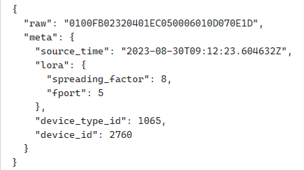

# Distant Heat Hex-Parser
Repository for collaborative development and testing of distant heat hex code parser.

## Instructions
Niotix only excepts node.js. Therefore no additional packets can be used.
### Objectives
The goal is to develop a complete and well tested hex-string to json-object parser for district heat meter packets sent via LoRaWAN, that can be implemented in the running system. 4 different device types, with different LoRaWAN modules exist ([see Device Types and Elvaco Modules](##Device-Types-and-Elvaco-Modules)). 

#### Objective List
- 4 device types
- several payload styles
- error parsing 
- meter communication error
- unit convertion
- automated testing (unit convertion, meter-communication-error, negative-values)
- plausibility testing

### Entry function
Niotix expects the following entry function (already implemented in all parser fiiles):
```js
module.exports = function (payload, meta) {
  return dict();
};
```

#### Payload argument
The payload contaisn the actual hex string (s. raw in image below)
#### Meta argument
Contains additional information about the packet (e.g source_time of the packet), which are used by Niotix in the further pipeline. Can be ignored for the parser, but must be in the argument list of the entry function:



*raw = payload*


## Device Types and Elvaco Modules
The Parser must be developed for 4 different device types:
- Landis & Gyr ULTRAHEAT T330 (UH30) 
- Landis & Gyr ULTRAHEAT T550 (UH50) 
- Diehl Sharky 775 (Sharky) 
- Itron CF Echo 2 (Itron) 

Every device type has its own elvaco LoRaWAN module.
- UH30    -->   [Elvaco_CMi4111](./docs/manuals/UH30_Elvaco_CMi4111.pdf)
- UH50    -->   [Elvaco_CMi4110](./docs/manuals/UH50_Elvaco_CMi4110.pdf)
- Sharky  -->   [Elvaco_CMi4160](./docs/manuals/Sharky_Elvaco_CMi4160.pdf)
- ITRON   -->   [Elvaco_CMi4130](./docs/manuals/Itron_Elvaco_CMi4130.pdf)

## Parsing challenges
Most of the parsing is simple transformation from hex to human readable format. But there are more challenging issues included:
### Error Flags
Error flags can easily be transformed to an integer. But in order to transform this into human readable format, its necessary to read the active error bites and add the according error messages provided by the producer of the meters (UH30 / UH50 ... --> not part of the elvaco module / manual).

[errorFlags.xlsx](./docs/ErrorFlags.xlsxdocs)

Several errors can occur on the same time. Which final format to chose for the errorflags. Also see meter communications error below. 

### Unit Conversion Testing
Measurements can be send in different units. But idealy they´re parsed in a consistent unit over all packets and device types.
Unit convertion can be error prone (comma error). Therefore proper automated testing is necessary.

### Meter Communication Error
S. Elvaco module manuals about meter communication error. How to parse this?

### Negative Values - Unsigned vs signed
In the past negative values have sometimes caused the result to be wrong. 

### Plausibility Checks
How can we make sure that the parsed value is in a plausible range?

### Creation of further testcases
S. Unit Convertion

## Current Versions
The current parser versions for UH30 and UH50 are to find in the "old" folder:

- [UH30](./old/UH30_old_niotix.js)
- [UH50](./old/UH50_old_niotix.js)


## Testcases
We already provided some [testcases](./testing/testCaseData.json) for all devices. These testcases can and should be completed with further test cases.
Testcases can be used for end-to-end testing. Also consider unit testing.